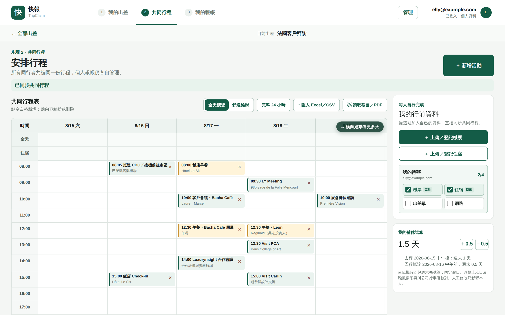
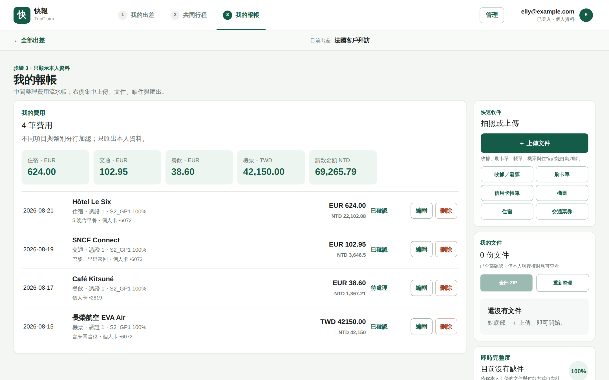
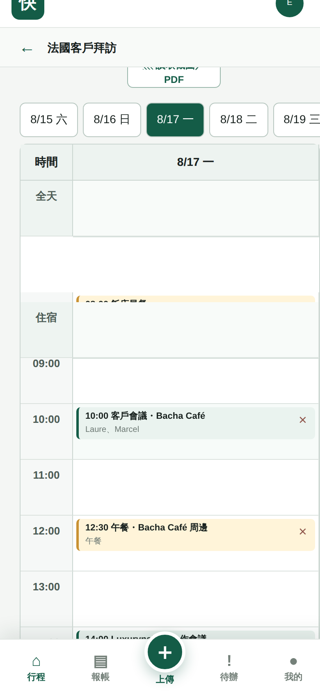
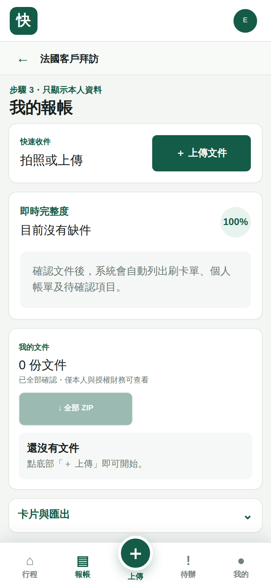

# 快報 TripClaim

> **出差報帳，不該比出差本身還累。**

「快報 TripClaim」把一趟出差最麻煩的兩件事——**多人行程對齊**與**回國後報帳**——變成一件在路上就順手完成的小事。行程一起排、單據隨手拍，回國後只確認例外，報帳直接收尾。

以 [Next.js 16](https://nextjs.org) + [vinext](https://github.com/cloudflare/vinext) 打造、跑在 [Cloudflare Workers](https://workers.cloudflare.com) 邊緣網路上的 PWA。

**🌐 線上網站：<https://quick-trip-claim.ellyfd.chatgpt.site/>**（需以 ChatGPT 帳號登入）

---

## 目錄

- [為什麼需要它](#-為什麼需要它)
- [三步驟，一氣呵成](#-三步驟一氣呵成)
- [實際畫面](#-實際畫面)
- [功能總覽](#-功能總覽)
- [隱私與權限設計](#-隱私與權限設計)
- [技術架構](#-技術架構)
- [快速開始](#-快速開始)
- [專案結構](#-專案結構)
- [API 一覽](#-api-一覽)
- [資料模型](#-資料模型)
- [測試與品質](#-測試與品質)
- [產品路線圖](#-產品路線圖)
- [相關連結](#-相關連結)

---

## 😩 為什麼需要它

- 出差回來，皮夾裡塞滿收據，Line 裡散落一堆訂房信與電子票券
- 花整個下午分類、換算幣別、重新命名檔案，還是被財務退件「缺信用卡帳單」
- 四個人同行，行程改了三版，永遠有人拿到舊版
- 機票、住宿明明上傳過一次，報帳時又要重打一遍

**快報 TripClaim 的答案：少輸入、預設自動、只讓人處理例外。**

## ✨ 三步驟，一氣呵成

### 1️⃣ 我的出差 — 開一趟行程，邀請大家加入

建立出差時**先選地點再選日期，出差名稱自動產生**；一鍵邀請同行者，每個人有自己的登入與權限。行程可共用，**機票、單據與報帳仍各自私有**。草稿自動保存，中途離開也不會遺失。

### 2️⃣ 共同行程 — 所有人看到的都是同一份最新版

- 共同行程表把**會議、三餐、住宿與交通**排進同一張週曆，點空白格即可新增
- 支援**匯入 Excel／CSV**，也能**上傳行程截圖或 PDF 讓 AI 讀取**
- 每位成員上傳自己的機票或訂房確認，**AI 自動辨識**航班、日期、金額——一次上傳，同步行程與待報支
- 側欄即時顯示**我的待辦**（機票／住宿／出差單／網路）與**補休試算**（依班機時間與週末自動計算）
- 行程確認後，**出差申請單自動產生**，日期、城市、交通、住宿、同行者直接帶入

### 3️⃣ 我的報帳 — 旅行模式，拿到單據就丟進來

- 拍照或上傳圖片、PDF、電子票券，**不用分類、不用填金額**
- OCR 與 AI 自動辨識日期、金額、幣別，換算台幣、建議標準檔名
- **例外優先確認匣**：系統處理掉確定的，只問你不確定的那幾筆
- **缺件中心**主動告訴你還缺哪些單據；信用卡帳單自動配對（依卡號末四碼、日期、外幣金額）正在開發中，進度見[路線圖](#-產品路線圖)
- 一鍵匯出 **CSV／Excel／列印 PDF**，附件可打包 **ZIP** 下載

> 「先處理 3 個例外，其他 15 筆不用看。」——這就是我們想給你的報帳體驗。

---

## 📸 實際畫面

**共同行程表**——會議、三餐、住宿排進同一張表，待辦與補休試算就在旁邊：



**我的報帳**——幣別分列加總、請款金額自動換算，每筆費用可直接編輯：



**手機版**——出差路上單手操作，拍照上傳就在拇指旁：

<p>
  
  &nbsp;
  
</p>

更多畫面見 [`docs/screenshots/`](docs/screenshots/)。

---

## 🧭 功能總覽

| 模組 | 說明 | 主要程式 |
|------|------|----------|
| 出差列表與建立精靈 | 三步驟建立、草稿自動保存、編輯與封存刪除 | [`CreateTripWizardLive.tsx`](app/CreateTripWizardLive.tsx) |
| 共同行程表 | 週曆檢視、雙密度切換、Excel／截圖匯入、橫向捲動提示 | [`AgendaSheet.tsx`](app/AgendaSheet.tsx)、[`ItineraryWizardLive.tsx`](app/ItineraryWizardLive.tsx) |
| 成員與邀請 | Email 邀請、編輯／查看權限、成員清單 | [`TripMembersPanel.tsx`](app/TripMembersPanel.tsx) |
| 個人機票／住宿登記 | 手動填寫或上傳辨識，一次同步行程與待報支 | [`TripTodoPanel.tsx`](app/TripTodoPanel.tsx)、[`BookingPanel.tsx`](app/BookingPanel.tsx) |
| 補休試算 | 依班機時間與週末先行試算，可人工加減 | [`CompLeavePanel.tsx`](app/CompLeavePanel.tsx) |
| 單據上傳與 OCR | 瀏覽器端 tesseract.js 辨識，失敗保留原檔待人工確認 | [`ExpenseWizardLive.tsx`](app/ExpenseWizardLive.tsx) |
| 費用列表與匯出 | 多幣別分列加總、逐筆編輯、CSV／Excel／列印 | [`ExpenseSummary.tsx`](app/ExpenseSummary.tsx) |
| 文件匣 | 已上傳文件管理、重新命名、ZIP 打包 | [`DocumentInbox.tsx`](app/DocumentInbox.tsx) |
| 缺件中心 | 依付款方式列出待補文件 | [`MissingRequirements.tsx`](app/MissingRequirements.tsx) |
| 卡片中心 | 個人信用卡登記，供帳單配對使用 | [`CardCenter.tsx`](app/CardCenter.tsx) |
| 出差申請單 | 由行程資料自動組成預覽 | [`TravelRequestPreview.tsx`](app/TravelRequestPreview.tsx) |
| 個人資料與管理 | 顯示名稱、通知信箱、管理視圖 | [`SystemManagement.tsx`](app/SystemManagement.tsx) |
| PWA | 可安裝、離線頁面、行動版底部導覽 | [`PWARegister.tsx`](app/PWARegister.tsx)、[`manifest.ts`](app/manifest.ts)、[`offline/`](app/offline/) |

**全球城市庫**：內建 43 國、140+ 個常用出差城市（[`CreateTripForm.tsx`](app/CreateTripForm.tsx)），支援中英文搜尋；機場代碼庫另收錄 1,700+ 筆（[`db/managed-airports.json`](db/managed-airports.json)）。

---

## 🔒 隱私與權限設計

協作不代表裸奔。快報 TripClaim 的權限設計原則：

| 資料 | 誰看得到 |
|------|----------|
| 行程時間、地點、住宿摘要 | 所有同行者 |
| 機票票價、付款方式 | 只有本人 |
| 收據、卡片、報支金額 | 本人與授權財務 |

- 每位同行者只維護自己的航班與住宿，分享頁只顯示必要摘要
- 單據的 OCR 文字辨識直接在**你的瀏覽器裡**執行（[tesseract.js](https://github.com/naptha/tesseract.js) 動態載入），檔案只上傳到應用自己的 Cloudflare 儲存空間——不會送往任何第三方 AI 服務
- 所有寫入操作都會留下稽核紀錄（`audit_logs`），並以樂觀鎖（version 欄位）防止多人同時編輯互相覆蓋
- API 層逐一驗證出差成員資格（[`db/access.ts`](db/access.ts)），跨帳號存取一律回 403

---

## 🛠 技術架構

```
瀏覽器（React 19 PWA + 客戶端 OCR）
   │  fetch /api/*
   ▼
Cloudflare Worker（vinext = Next.js App Router on Vite）
   │  Drizzle ORM
   ▼
Cloudflare D1（SQLite）＋ R2（附件儲存）
```

| 層 | 技術 | 版本 |
|----|------|------|
| 前端框架 | [Next.js](https://nextjs.org)（App Router）+ [React](https://react.dev) | 16 / 19 |
| 樣式 | [Tailwind CSS](https://tailwindcss.com) | 4 |
| 執行環境 | [vinext](https://github.com/cloudflare/vinext)（Vite + Cloudflare Workers） | — |
| 資料庫 | [Cloudflare D1](https://developers.cloudflare.com/d1/) + [Drizzle ORM](https://orm.drizzle.team) | — |
| 附件儲存 | [Cloudflare R2](https://developers.cloudflare.com/r2/) | — |
| 文件辨識 | [tesseract.js](https://github.com/naptha/tesseract.js)（OCR）+ [unpdf](https://github.com/unjs/unpdf)（PDF 解析） | — |
| 身分驗證 | Sign in with ChatGPT（[`app/chatgpt-auth.ts`](app/chatgpt-auth.ts)）；自架部署改用 Cloudflare Access（[`worker/cf-access.ts`](worker/cf-access.ts)） | — |

綁定宣告於 [`.openai/hosting.json`](.openai/hosting.json)（D1 binding `DB`、R2 binding `BUCKET`）；本地開發由 [`vite.config.ts`](vite.config.ts) 以 miniflare 模擬。

### 部署選項

| 方式 | 說明 |
| --- | --- |
| GPT site（現況 live demo） | 由 ChatGPT Sites 平台代管與發布，以 ChatGPT 帳號登入 |
| **自架 Cloudflare**（不走 GPT site） | 部署到自己的 Cloudflare 帳號（Workers + D1 + R2），以 Cloudflare Access 登入，可綁自訂網域 → **[自架部署指南](docs/deploy-cloudflare.md)**，一鍵指令 `npm run deploy:cloudflare` |

---

## 🚀 快速開始

**環境需求**：Node.js `>= 22.13.0`、Linux（需要 `flock`、`curl`、GNU `timeout`）

```bash
npm run install:ci        # 鎖定版本的一次性安裝（單一 socket、含逾時保護）
npm run dev               # 啟動開發伺服器（http://localhost:5173）
npm run db:migrate:local  # 首次啟動 dev 後執行：套用本機 D1 遷移（否則 API 會回 500）
```

**本機模擬登入**：身分來自 `oai-authenticated-user-email` 請求標頭（正式環境由平台注入）。本機測試時可用瀏覽器擴充或 `curl -H` 附帶該標頭。

其他常用指令：

```bash
npm test                  # 建置 + 產物驗證 + 測試
npm run build             # 建置並驗證可部署的 Sites 產物
npm run lint              # ESLint
npm run db:generate       # schema 變更後產生 Drizzle 遷移
npm run validate:artifact # 重新檢查既有建置產物
```

疑難排解：

| 症狀 | 原因與解法 |
|------|-----------|
| API 全部回 500 `no such table` | 本機 D1 尚未建表 → `npm run db:migrate:local` |
| API 回 401 `authentication_required` | 請求缺少身分標頭（見上方本機模擬登入） |
| `scripts/*.sh: Permission denied` | 執行位元遺失 → `chmod +x scripts/*.sh` |

---

## 📁 專案結構

```
app/                    # 頁面與元件（22 個元件 + App Router API）
├─ page.tsx             # 主頁：三階段流程切換
├─ layout.tsx           # PWA metadata、字型、viewport
├─ api/                 # 全部後端 API（見下方 API 一覽）
├─ chatgpt-auth.ts      # SIWC 身分輔助函式
├─ globals.css          # 全站樣式（含響應式與行動版）
└─ offline/             # PWA 離線頁
db/
├─ schema.ts            # Drizzle 資料表定義（14 張表）
├─ access.ts            # 成員資格與權限檢查
└─ managed-airports.json# 機場代碼庫
drizzle/                # 資料庫遷移（0000–0013）
scripts/                # 安裝／建置／驗證／本機遷移腳本
tests/                  # 建置產物與安全邊界測試
docs/screenshots/       # README 產品截圖
```

---

## 🔌 API 一覽

所有端點都要求登入身分，並在出差層級檢查成員資格。

| 端點 | 方法 | 用途 |
|------|------|------|
| [`/api/trips`](app/api/trips/route.ts) | GET / POST | 我的出差列表、建立出差 |
| [`/api/trips/[id]`](app/api/trips/%5Bid%5D/route.ts) | PATCH / DELETE | 編輯、封存出差 |
| [`/api/trips/[id]/agenda`](app/api/trips/%5Bid%5D/agenda/route.ts) | GET / POST | 共同行程項目 |
| [`/api/trips/[id]/agenda/[itemId]`](app/api/trips/%5Bid%5D/agenda/%5BitemId%5D/route.ts) | PATCH / DELETE | 編輯／刪除行程項目（樂觀鎖） |
| [`/api/trips/[id]/bookings`](app/api/trips/%5Bid%5D/bookings/route.ts) | GET / POST | 個人機票／住宿登記 |
| [`/api/trips/[id]/bookings/[bookingId]`](app/api/trips/%5Bid%5D/bookings/%5BbookingId%5D/route.ts) | PATCH / DELETE | 編輯／刪除登記 |
| [`/api/trips/[id]/bookings/[bookingId]/attachment`](app/api/trips/%5Bid%5D/bookings/%5BbookingId%5D/attachment/route.ts) | GET | 下載登記附件 |
| [`/api/trips/[id]/members`](app/api/trips/%5Bid%5D/members/route.ts) | GET / POST | 成員清單、邀請 |
| [`/api/trips/[id]/todos`](app/api/trips/%5Bid%5D/todos/route.ts) | GET / PATCH | 行前待辦勾選 |
| [`/api/trips/[id]/summary`](app/api/trips/%5Bid%5D/summary/route.ts) | GET | 行程摘要 |
| [`/api/trips/[id]/travel-request`](app/api/trips/%5Bid%5D/travel-request/route.ts) | POST | 產生出差申請單 |
| [`/api/documents`](app/api/documents/route.ts) | GET / POST | 單據上傳（含 OCR 結果）與列表 |
| [`/api/documents/[id]`](app/api/documents/%5Bid%5D/route.ts) | GET / PATCH / DELETE | 單據下載、更名、刪除 |
| [`/api/expenses`](app/api/expenses/route.ts) | GET | 我的費用列表 |
| [`/api/expenses/[id]`](app/api/expenses/%5Bid%5D/route.ts) | PATCH / DELETE | 編輯／刪除費用 |
| [`/api/cards`](app/api/cards/route.ts) | GET / POST | 個人信用卡登記 |
| [`/api/missing-requirements`](app/api/missing-requirements/route.ts) | GET | 缺件清單 |
| [`/api/my-travel`](app/api/my-travel/route.ts) | GET / POST | 跨出差的個人旅行文件 |
| [`/api/drafts`](app/api/drafts/route.ts) | GET / PUT | 精靈草稿自動保存 |
| [`/api/me`](app/api/me/route.ts) | GET / PATCH | 個人資料 |

---

## 🗃 資料模型

定義於 [`db/schema.ts`](db/schema.ts)，遷移檔在 [`drizzle/`](drizzle/)：

| 資料表 | 內容 |
|--------|------|
| `trips`、`trip_destinations`、`trip_members` | 出差、目的地、成員與角色 |
| `agenda_items` | 共同行程項目（含版本與編輯者） |
| `travel_bookings` | 個人機票／住宿登記 |
| `personal_expenses` | 個人費用（幣別、匯率、請款金額、卡末四碼） |
| `uploaded_documents`、`travel_documents` | 上傳單據與旅行文件 |
| `personal_cards` | 個人信用卡 |
| `travel_requests` | 出差申請單 |
| `trip_member_todos` | 行前待辦勾選狀態 |
| `trip_drafts` | 精靈草稿 |
| `user_profiles` | 使用者資料 |
| `audit_logs` | 全部寫入操作的稽核紀錄 |

---

## ✅ 測試與品質

```bash
npm test    # 建置 + 產物驗證 + node --test
```

- [`tests/rendered-html.test.mjs`](tests/rendered-html.test.mjs)：開發預覽渲染與 metadata 驗證
- [`tests/security-boundaries.test.mjs`](tests/security-boundaries.test.mjs)：API 權限邊界（未登入 401、非成員 403）
- UI 變更另以 Playwright 於桌面（1440px）與行動（390px）雙視口實測，紀錄見 PR [#2](https://github.com/ellyfd/TripClaim/pull/2)、[#3](https://github.com/ellyfd/TripClaim/pull/3)、[#4](https://github.com/ellyfd/TripClaim/pull/4)
- **自動測試＋合併**：PR 建立後由 [`auto-test-merge.yml`](.github/workflows/auto-test-merge.yml) 跑 `npm test`，通過且版本未變動即自動 squash 合併並刪除分支；限本人、本 repo、非 Draft 的 PR，掛 `no-auto-merge` 標籤可跳過

---

## 🗺 產品路線圖

| 優先 | 項目 | 狀態 |
|------|------|------|
| P0 | 旅行模式：一鍵拍照／上傳 | ✅ 已完成 |
| P0 | 例外優先確認匣 | ✅ 已完成 |
| P0 | 多人登入與行程分享 | ✅ 原型完成 |
| P0 | 信用卡帳單自動配對 | 🔜 下一階段 |
| P1 | Email／訊息收據入口 | 🔜 下一階段 |
| P1 | 住宿明細自動拆項 | 🔜 下一階段 |
| P1 | 公司規則即時檢核 | 📋 規則盤點中 |
| P2 | 公司報帳系統串接 | ⏳ 待 API |

---

## 🔗 相關連結

**專案**

- [線上網站](https://quick-trip-claim.ellyfd.chatgpt.site/) — 快報 TripClaim live demo（需 ChatGPT 登入）
- [自架部署指南](docs/deploy-cloudflare.md) — 部署到自己的 Cloudflare 帳號（不走 GPT site）
- [GitHub Repo](https://github.com/ellyfd/TripClaim)
- [變更歷史（已合併 PR）](https://github.com/ellyfd/TripClaim/pulls?q=is%3Apr+is%3Amerged)

**技術文件**

- [vinext](https://github.com/cloudflare/vinext) — Cloudflare 上的 Next.js 執行環境
- [Next.js App Router](https://nextjs.org/docs/app)
- [Drizzle ORM × D1 入門](https://orm.drizzle.team/docs/get-started/d1-new)
- [Cloudflare D1](https://developers.cloudflare.com/d1/)／[R2](https://developers.cloudflare.com/r2/)
- [tesseract.js](https://github.com/naptha/tesseract.js) — 瀏覽器端 OCR
- [unpdf](https://github.com/unjs/unpdf) — Serverless PDF 解析
- [Tailwind CSS v4](https://tailwindcss.com/docs)

---

**快報 TripClaim** — 把單據丟進來，剩下的交給我們。出差的每一分鐘，都該花在正事上。
